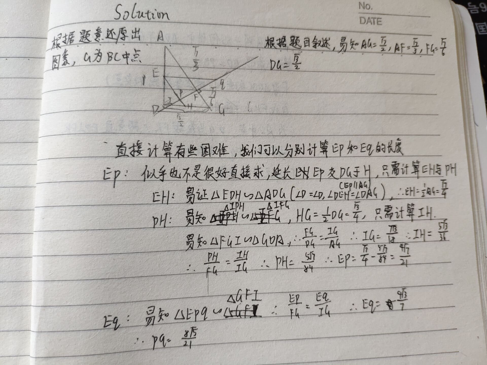

# sol3 

test

fadlkjflaskjdflksajflkjaslkdfj

#include<iosteram></iosteram>
using namespace std;
inline int read() {
    char c = getchar(); int x = 0, f = 1;
    while(c < '0' || c > '9') {if(c == '-') f = -1; c = getchar();}

}
int main() {

    return 0;
}